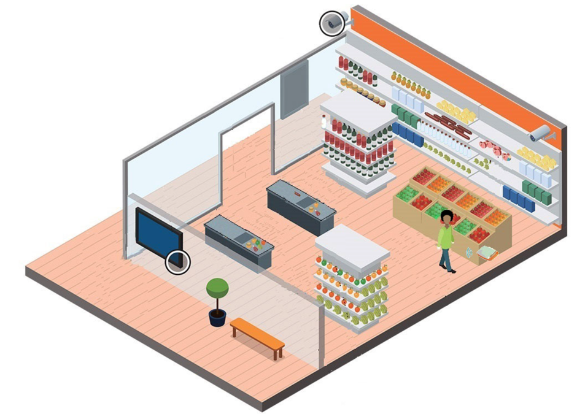
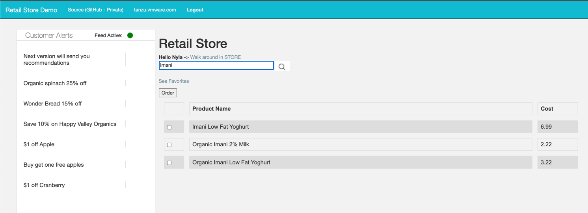

# What's This All About

This project includes a demonstration of caching, data pipeline processing, and analytics for a retail use case. It will showcase the value that technologies such as [GemFire](https://tanzu.vmware.com/gemfire), [VMware Postgres](https://tanzu.vmware.com/postgres), [VMware RabbitMQ](https://tanzu.vmware.com/rabbitmq), [Spring](https://spring.io/) and Kubernetes in a Cloud-Native Data Architecture.

## The Scenario

There is a chain of supermarkets that has a loyalty program.  Customers get discounts by registering for the program.  This generates a wealth of data about what they purchase.  One insight we can gain is which items tend to be purchased together which can be done by examining the cash register receipts and using an analytic tool called association rules that determine which pair or triplets or quadruplets of items commonly appear in a market basket.  This information is aggregated over the entire customer base.
We can also determine a particular customer's purchase pattern and see their most common purchases.

Retail establishments can place low-powered Bluetooth beacons in their stores.  When a customer walks near one and the store's loyalty app is active on their phone, the app can detect that the customer has just passed within a very short distance of the beacon.  
The supermarket can place a beacon at the end of each aisle, at the store entrance, at the deli counter, at the checkout counter, etc, and trace the path of the customer through the store.

Merging the association rule information and the customer buying pattern and location in the store,  the app can deliver a location-specific message.  For example, it can issue a welcome message near the store entrance, and a reminder message near the checkout locations.

It can notice that the customer is a frequent buyer of pizza and notify the customer about a special offer when he or she is on the frozen
food aisle.




It can use the association rules to suggest that if a common pair of items is Spicy Sausage and Extra Strength Stomach Calmer, and the customer is a frequent Spicy Sausage buyer, that when the customer approaches the Heath and Beauty Aids aisle, he or she might want to
pick up a bottle of Stomach Calmer.





## What are the Cloud Native Data Products in the demo?

CloudNative Data Product | Overview
-------------------------- | ---------------------------------
[VMware Tanzu](https://tanzu.vmware.com/tanzu)| the platform framework on which all the other bits run
[Kubernetes](https://tanzu.vmware.com/kubernetes-grid) | the control of the application code and its home
Postgres or Greenplum | the analytic Postgres database that stores customer data and generates insight into buying behavior. It is a Massively Parallel Processing  (MPP) analytic database for petabyte-scale data volumes.
[GemFire](https://tanzu.vmware.com/gemfire) | where the app gets information from about customers it detects are in the store. VMware backing service implementation for GemFire/Apache Geode
Spring Cloud Data Flow  (SCDF) | Orchestrates the flow of data between the app, GemFire, and Postgres. It is s Multi-Cloud Spring Cloud Data Flow ESB/ETL-based integration platform that runs on a Cloud-based PaaS such as Kubernetes.
[RabbitMQ](https://www.rabbitmq.com/) | a message broker used by SCDF


##  How Does it Work?

The first Minimum Viable Product (MVP) version is a small supermarket. There are several product area beacons. There is also one at the entrance and one at the checkout.


The application can be deployed on VMware Tanzu.
Users can open a window to simulate walking through a store.

Clicking on a particular map area will trigger the sending of location information messages to a RabbitMQ queue. This starts a spring cloud stream asynchronous data flow. The data flow will recalculate updates to the customer's favorite products based on analytical buying history. The data flow will also search for promotions of products in the beacon area.

Discovered promotions are cached into GemFire.
GemFire notifies the application asynchronously of the discovered promotions.
The application's user interface will display these promotions in near real time.


# Setup Maven

Install gemfire-extensions-core

```shell
mvn install:install-file -Dfile=libs/gemfire-extensions-core-1.0.0.jar -DgroupId="io.pivotal.services.dataTx" -DartifactId=gemfire-extensions-core -Dversion=1.0.0 -Dpackaging=jar
```


Install gemfire-extensions-core

```shell
mvn install:install-file -Dfile=applications/libs/gemfire-extensions-core-1.0.0.jar -DgroupId="io.pivotal.services.dataTx" -DartifactId=gemfire-extensions-core -Dversion=1.0.0 -Dpackaging=jar
```


Install gemfire-extensions-spring-security

```shell
mvn install:install-file -Dfile=applications/libs/security/gemfire-extensions-spring-security-1.0.0.jar -DgroupId="io.pivotal.services.dataTx" -DartifactId=gemfire-extensions-spring-security -Dversion=1.0.0 -Dpackaging=jar
```


# Startup


Create DB users


```shell
create user pivotalmarkets with PASSWORD 'pivotalmarkets';
create schema pivotalmarkets;
GRANT ALL PRIVILEGES ON ALL TABLES IN SCHEMA public TO pivotalmarkets;
ALTER ROLE pivotalmarkets SET search_path TO pivotalmarkets;
ALTER SCHEMA pivotalmarkets OWNER TO pivotalmarkets;
```

Login as pivotalmarkets

```shell
psql -d postgres -U pivotalmarkets
```


Run migration

```shell
java -jar applications/retail-analytics-migration/target/retail-analytics-migration-0.0.2-SNAPSHOT.jar --spring.profiles.active=postgres-local    
```


Run analytics application


```shell
java -jar applications/retail-analytics-stream/target/retail-analytics-stream-0.0.4-SNAPSHOT.jar --spring.profiles.active=postgres-local
```


Run web applications

```shell
java -jar applications/retail-store-app/target/retail-store-app-0.0.3.jar 
```
